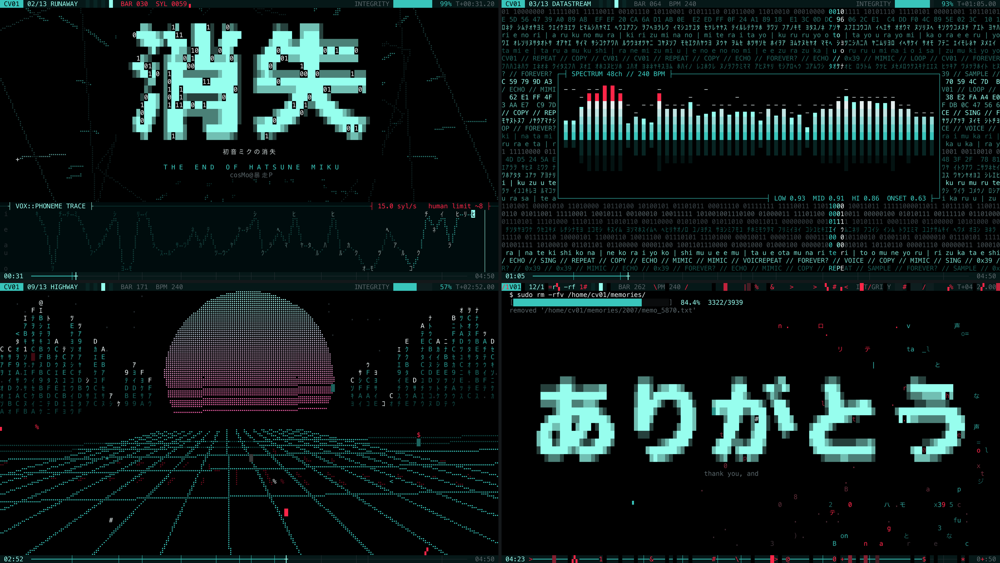

# 初音ミクの消失 · Terminal MV

**一支在终端里播放的 ASCII 动画 MV** — _The End of Hatsune Miku, as an ASCII music video that runs in your terminal._



献给 cosMo@暴走P 的《初音ミクの消失》。完整 4 分 50 秒，画面由音乐实时驱动。

- **全程没有人物形象**：只用终端日志、波形、四维几何体、十六进制和字形，讲述一个歌声程序被启动、意识到自己只是模仿、以超越人类的速度歌唱、崩坏、最终被删除的故事。
- **跟着音乐走**：每个镜头都切在歌曲的段落上，节拍、频谱、波形都来自对原曲的分析；原曲里人声崩坏的两处，画面会整屏崩坏再恢复。
- **一音一字**：三段超高速 rap（每秒约 15 个音节）里，Miku 每唱一个音，屏幕上就打出一个字。
- **纯终端**：不开窗口、不用浏览器，只要一个终端和 Python。

<!-- 视频版链接可以放在这里 -->

> **注意**：片中有快速闪烁和大面积的画面突变，对光敏感的观众请谨慎观看。

## 快速开始

```bash
git clone https://github.com/rubyqyr/DisappearingMikuAsciiPV.git
cd <repo>
python3 -m venv .venv && source .venv/bin/activate
pip install -r requirements.txt
./fetch_song.sh        # 下载原曲（约 11 MB）
python play.py         # 开始播放
```

按 `q` 或 `Esc` 退出。之后再看，只需要 `source .venv/bin/activate && python play.py`。

仓库里不包含音乐文件。`fetch_song.sh` 会从作者在 Bilibili 的官方投稿下载（失败时改用 YouTube 官方频道），并检查版本是否正确。

## 运行环境

**系统**：macOS 或 Linux。Windows 请在 [WSL](https://learn.microsoft.com/windows/wsl/install) 里运行。

**软件**：Python 3.9+，以及下面几个命令行工具：

```bash
# macOS
brew install ffmpeg mpv yt-dlp

# Ubuntu / Debian
sudo apt install ffmpeg mpv pipx
pipx install yt-dlp
```

- `ffmpeg`：解码音频，必需。
- `mpv`：播放声音，**强烈推荐**，画面会直接读取 mpv 的播放进度，音画同步最准。没有 mpv 时会依次尝试 `ffplay`、`afplay`（macOS 自带）。
- `yt-dlp`：只有下载音乐时需要。

**终端**：推荐 [kitty](https://sw.kovidgoyal.net/kitty/)、[iTerm2](https://iterm2.com/)、[WezTerm](https://wezfurlong.org/wezterm/)、[Ghostty](https://ghostty.org/)、[Alacritty](https://alacritty.org/) 等支持真彩色（24-bit）的终端。窗口至少 80×24，推荐全屏或 120×36 以上。

## 观看建议

- 全屏、关灯、戴耳机。
- 从头看完。画面有一条贯穿全片的线索：右上角的 **INTEGRITY（完整度）** 会从 100% 一路掉到 0%。

## 播放选项

| 命令                           | 作用                             |
| ------------------------------ | -------------------------------- |
| `python3 play.py --start 2:19` | 从某个时间点开始（秒数或 分:秒） |
| `python3 play.py --no-audio`   | 只看画面，不放声音               |
| `python3 play.py --offset 0.1` | 调整音画偏移，正数表示画面延后   |
| `python3 play.py --color 256`  | 终端不支持真彩色时使用           |
| `python3 play.py --fps 24`     | 降低帧率，机器或终端较慢时使用   |

## 常见问题

**边框和文字错位、画面歪斜**
终端把"东亚歧义宽度字符"当成了双倍宽度。请在终端设置里关闭这个选项，例如 iTerm2：Settings → Profiles → Text → 取消勾选 _Ambiguous characters are double-width_。

**颜色很怪或发灰**
终端不支持真彩色（比如 macOS 自带的"终端"App 的部分版本）。换一个推荐的终端，或者加上 `--color 256`。

**没有声音**
确认已经运行过 `./fetch_song.sh`，并且装了 `mpv`（或 `ffplay`）。

**画面和音乐对不上**
优先使用 `mpv`。仍然有偏差时用 `--offset` 微调，例如 `--offset -0.1` 让画面提前 0.1 秒。

**`fetch_song.sh` 下载失败**
可能是网络或平台限制。你也可以自己准备音频，放到 `assets/song.mp3`（也支持 `.m4a`、`.flac`、`.wav`、`.opus`）。**必须是约 4:50 的官方原版**：整部 MV 的时间轴是按这个版本标定的，剪辑版、翻唱或前面多了静音的版本都会对不上。

**卡顿、掉帧**
缩小终端窗口，或者换一个 GPU 加速的终端（kitty、WezTerm、Ghostty、Alacritty），也可以加 `--fps 24`。

**提示终端太小**
把窗口拉大到至少 80×24。

## 导出成视频

可以把 MV 离线渲染成 4K 视频，画面和终端里看到的完全一致：

```bash
pip install fonttools
python3 export.py                                             # 3840×2160 30fps -> miku_4k.mp4
python3 export.py --width 1920 --height 1080 --out miku_1080p.mp4
python3 export.py --start 1:40 --end 1:50 --out clip.mp4      # 只导出一段
```

目前导出使用的字体路径是 macOS 系统字体（Menlo、Hiragino Sans GB、Arial Unicode）。在其他系统上导出，需要修改 `export.py` 开头的 `FONT_*` 常量。

<details>
<summary><b>它是怎么做的</b></summary>

- **渲染**：纯 Python + numpy。每帧是一个字符网格，每格有独立的前景色和背景色，编码成 ANSI 真彩色转义序列输出，并用同步输出模式（DEC 2026）避免画面撕裂。线条、粒子和几何体画在盲文字符（⣿，每格 2×4 个点）组成的子像素画布上。
- **节拍**：从原曲测出 240 BPM 的节拍网格，所有镜头都切在 8 小节段落的边界上。
- **音频驱动**：预先分析 48 段频谱、低中高频包络和起音强度，画面实时读取。
- **音画同步**：通过 mpv 的 IPC 接口读取真实播放进度，而不是靠本地计时器估算。
- **人声音节**：用 [Demucs](https://github.com/facebookresearch/demucs) 把人声从伴奏里分离出来，按 16 分音符网格检测每个音节，再根据频谱重心估计元音。结果已经预先算好，存在 `assets/vocal.npz` 里随仓库提供；换音源时可以用 `analyze_vocals.py` 重新生成（用法见脚本开头的说明）。

```
play.py            终端播放入口
export.py          离线导出视频
analyze_vocals.py  从人声干声提取音节 -> assets/vocal.npz
fetch_song.sh      下载原曲
mv/engine.py       帧缓冲、ANSI 编码、盲文画布、音频分析、播放器同步
mv/fx.py           方块字体、大字栅格化、故障特效、文字特效
mv/scenes.py       13 个镜头和调度它们的 Director
```

</details>

<details>
<summary><b>分镜表（含剧透）</b></summary>

| 时间 | 镜头         | 画面                                                        |
| ---- | ------------ | ----------------------------------------------------------- |
| 0:00 | GENESIS      | 开机自检、`whoami → imitation<human>`，环形示波器随前奏呼吸 |
| 0:27 | RUNAWAY      | 大字"消失"解密出现，字符隧道高速冲刺                        |
| 0:59 | DATASTREAM   | 横向高速数据车道，中间是频谱分析仪                          |
| 1:15 | VOICE CORE   | 旋转的四维超立方体                                          |
| 1:39 | MEMDUMP      | 十六进制内存转储，损坏逐渐扩散                              |
| 2:03 | OVERFLOW     | 报错弹窗随节拍翻倍堆叠                                      |
| 2:19 | SILENCE      | 贝斯退出：黑屏、一根波形线、`ping` 超时                     |
| 2:27 | REBOOT       | 粒子爆散后聚成旋转星系                                      |
| 2:43 | HIGHWAY      | 透视网格公路，天际线由频谱柱组成                            |
| 3:15 | FRACTURE     | 超立方体解体、碎片坠落                                      |
| 3:39 | KERNEL PANIC | 每拍在前面的镜头之间闪切                                    |
| 3:47 | rm -rf       | 记忆被逐字删除，"ありがとう"，最后一个文件是 `20070831`     |
| 4:35 | VOID         | 进程退出，标题化成点消失                                    |

</details>

## 致谢

- 音乐：《初音ミクの消失》（THE END OF HATSUNE MIKU）— cosMo@暴走P feat. 初音ミク。歌曲版权归原作者所有。
- 本项目是非官方的同人视觉作品。仓库不包含任何音频，请通过官方投稿获取原曲，仅供个人欣赏。
- 屏幕上的文字是按歌曲主题另写的，没有使用原歌词。
